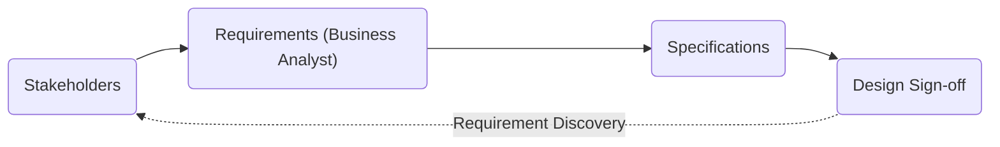
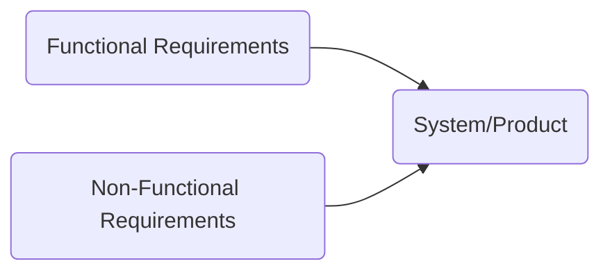
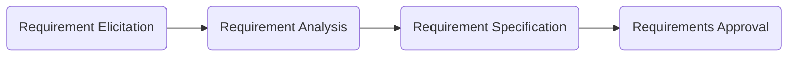

# Requirements Basics and Gathering

## What is the Requirement in an IT Project?

Barry Boehm (1981) defines requirements as "designing the right thing."

- List of **WHAT** the Stakeholders need
- List of **WHAT** the System/App must do to Satisfy those needs
- List of **WHAT** components must be built/developed
- List of **WHAT** each component must **DO** and **HOW** they will **INTERACT**

### The Weight of Ambiguous Requirements

In 1995, from 8000 projects reviewed, 50% of failures were due to requirements. In 2015, 68% of IT projects failed due to ambiguous requirements.

### The Traditional Project Process

### What Do Requirements Focus On?

- What the system must do?
- What properties must the system have?
- What information is involved?
- What degree of quality is expected?
- What constraints apply to the system?
- Who and how the system should be used?

### Categories of Requirements

| Functional                                                                              	| Non-Functional                                                    	|
|-----------------------------------------------------------------------------------------	|-------------------------------------------------------------------	|
| Describe **What** the product does                                                        | Describe **How** the product works                                    |
| Define Product **Features**                                                               | Define Product **Properties**                                         |
| Focus on **User Requirements**                                                            | Focus on **User Expectations**                                        |
| Captured in **Use Case**                                                                  | Captured as **Quality Attribute**                                     |
| Mandatory                                                                               	| Not Mandatory, but Desirable                                     	    |
| Usually defined by **User**                                                               | Usually defined by **Developers or other tech experts**              	|
| Component, API, UI, etc.                                                                	| Performance, Usability, Security, etc.                            	|
| External Interface, Authentication, Authorization Levels, Business Rules, etc. 	| Usability,  Reliability, Scalability,  Performance, etc. 	|

#### Functional Requirements

| Things the product must do                               	| Action the product must take                                      	|
|----------------------------------------------------------	|-------------------------------------------------------------------	|
| Scope of the Product                                     	| Functional and Data Requirements                                  	|
| Defines the boundaries and connections to other products 	| Things the product must do and data manipulated by the functions. 	|

#### Non-Functional

| Properties or qualities the product must have 	| How the product will behave                  	|
|-----------------------------------------------	|----------------------------------------------	|
| Look and Feel Requirements                    	| Usability Requirements                       	|
| Performance Requirements                      	| Operational Requirements                     	|
| Legal Requirements                            	| Security Requirements                        	|
| Cultural and Political Requirements           	| Maintainability and Portability Requirements 	|

#### Product Constraints

| Purpose of the Project                                   	| Users of the Product                                      	|
|----------------------------------------------------------	|-----------------------------------------------------------	|
| Reason for building the product                          	| People who interact with the product                      	|
| Intended end-users and how they affect product usability 	| Limitations of the project and restrictions on design     	|
| Naming Conventions and Definitions                       	| Outside influences that make a difference to this product 	|
| Assumptions developers are making                        	| Assumptions developers are making                         	|

## SMART Technique for Requirements Structure

- **S**pecific
- **M**easurable
- **A**ttainable
- **R**easonable
- **T**raceable

### Specific

Evident, no ambiguity. Consistent, same terminology throughout. Simple.

Questions to Ask:

- What?
- Why?
- Who?
- Where?

Guidelines:

- Avoid “some,” “several,” “many”
- State pronouns clearly: “A calls B. It is updated.”
- Specify units all with numbers
- Use pictures to clarify understanding
- Provide explanations for terms like “transmitted,” “sent,” “downloaded,” and “processed.”

### Measurable

Measure progress towards the goal. Indicators should be quantifiable.

Questions to Ask:

- How much?
- How many?
- How can I know when it is accomplished?

Guidelines:

- Ensure measurable during requirement elicitation.
- Validate unequivocal success can be proven with that requirement.
- Determine tests that must be used to verify the requirement was met.

### Attainable

Validate requirement is feasible within the technical expertise, project scope, and budget.

Questions to Ask:

- Is there a theoretical solution to the problem?
- Has it been done before?
- Are there any known constraints (environmental, physical, etc.)?

Guidelines:

- Determine who has responsibility for satisfying the requirement and validate they can deliver.
- Ensure sufficient time, resources, and budget.
- Reuse pieces from previous projects.

### Reasonable

Validate the effort is worth the requirement.

Questions to Ask:

- Do you think this is worthwhile?
- Is the timing right?
- Do you think this matches our other efforts/needs?

Guidelines: 

- Run all requirements through a 'sanity check'.
- Make sure the requirement makes sense in the context of the project.

### Traceable

Trace requirements through design, implementation, and testing.

Questions to Ask:

- Can I ensure this requirement has been met in the design solution?
- Can I make sure this requirement has been met in the implementation?
- Can I ensure this requirement has been met during testing?

Guidelines

- Requirements should include
- Originators
- Assumptions
- Business justifications
- Dependencies on other requirements
- Importance

### Tips for Producing Valid Requirements

- Use the word **shall**
- Only one **shall** per requirement
- Written in short, simple sentences
- Consistent terminology
- Stated positively
- Accompanied by notes and comments to support and clarify
- Stated imperatively
- Don't use **will** and **should**

### Phases of the Requirements Process

## How to Elicit Requirements from Stakeholders?

- Brainstorming
- Observation
- Interview
- Survey
- Documentation Review

### Brainstorming

Brainstorming is a creative technique for developing new ideas and solving problems.

Brainstorming Types

- Individual - Project team member creates a list of ideas.
- Open - Participants call out ideas that are captured by the scribe.
- Structured - Participants write down their ideas, and the Facilitator goes from participant to participant to have them share one idea each. Continue until all ideas are exhausted.

| Advantages                                                                                                                                           	| Disadvantages                                                                                                                	|
|------------------------------------------------------------------------------------------------------------------------------------------------------	|------------------------------------------------------------------------------------------------------------------------------	|
| Helps to explore different possibilities and uncover new requirements.                                                                               	| Dominant participants overshadowing others or group think, where conformity hinders the exploration of diverse perspectives. 	|
| Rapid generation of many ideas, fostering creativity and innovation.                                                                    	| Ideas are not discussed/explored.                                                                                            	|
| Involves multiple perspectives and different project contexts.                                                                                       	| True meaning may need to be clarified or understood.                                                                              	|
| Promotes equal participation as it actively engages team members and stakeholders, making them feel involved in the requirement elicitation process. 	| Time constraints may result in rushed discussions, leading to superficial or incomplete requirement generation.              	|

