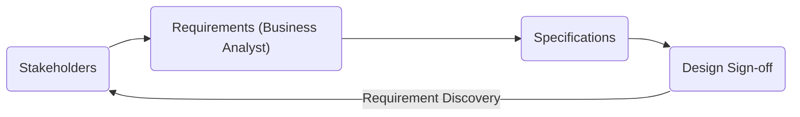

# Requirements Basics and Gathering

## What is the Requirement in an IT Project?

Barry Boehm (1981) defines requirements as "designing the right thing."

- List of **WHAT** the Stakeholders need
- List of **WHAT** the System/App must do to Satisfy those needs
- List of **WHAT** components must be built/developed
- List of **WHAT** each component must **DO** and **HOW** they will **INTERACT**

### The Weight of Ambiguous Requirements

In 1995, from 8000 projects reviewed, 50% of failures were due to requirements. In 2015, 68% of IT projects failed due to ambiguous requirements.

### The Traditional Project Process

### What Do Requirements Focus On?

- What the system must do?
- What properties must the system have?
- What information is involved?
- What degree of quality is expected?
- What constraints apply to the system?
- Who and how the system should be used?

