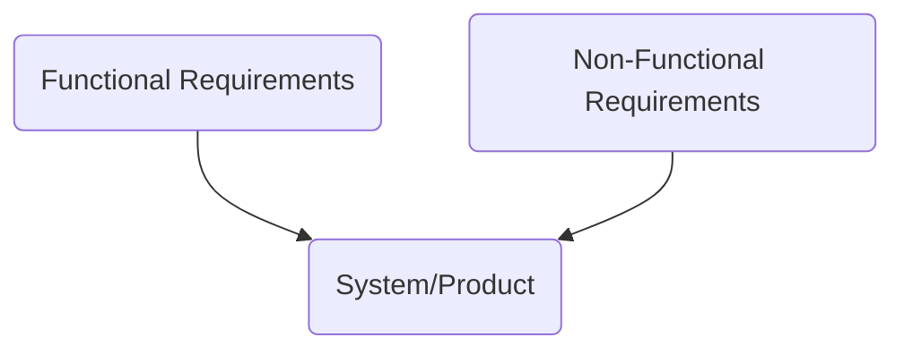

# Requirements Analysis and Specification

## Specification of Project Requirements

## Business Rules

Business rules describe the operations, definitions, and constraints that apply to an organization intended to assert business structure or to control or influence the behavior of the business. Outline the policies, procedures, or regulations governing the industry. It is defined by stakeholders, subject matter experts, or regulatory bodies.

**Business Rules Examples**:

- A customer must be at least 18 years old to purchase alcohol.
- All employees must submit their timesheets by Friday at 5:00 PM.
- Customers should be notified and offered a rain check if an item is out of stock.
- Customers must have a valid driver's license to rent a vehicle.
- A quote must be completed before an invoice is generated.

**Business Rules vs. Business Requirements**

**Business Rules** are lists of statements that tell you whether you may or may not do something or give you the criteria and conditions for making a decision. **Guidelines for behavior and decision-making within business.**

**Business Requirements** are what you need to do to enable the implementation of and compliance with Business Rules. **Describe the high-level goals and outcomes that a project or initiative should achieve.**

**EACH BUSINESS RULE MAY NEED MULTIPLE REQUIREMENTS**

Example:

Business Rule: **A quote must be completed before an invoice is generated.**

Business Requirements: 

- Capability to enter a quote.
- Details from the quote must automatically flow to the invoice.
- Ability to tie the quotes and invoices together for reporting.

## Deriving Requirements

### Parsing Requirements 

Breaking down requirements that are too broad. Removing 'and' from requirements.

**Example** 

**Original Requirement**:

User-completed fields on tax forms shall be converted to electronic text documents.

**Parsed Requirements**:

- The system shall be able to convert handwriting to text.
- The system shall be able to convert machine print to text.
- The system shall be able to correct user-completed fields electronically.

### Interpreting Requirements

Reduce the generalness and ambiguity of stated requirements.

**Example** 

**Original Requirement:**

Each PC shall have state-of-the-art software installed.

**Interpreted Requirement:**

Each PC shall have Microsoft Office 2019 and Windows 10 installed.

### Focusing Requirements

Combine overlapping requirements into one focused condition?

**Example** 

**Original Requirements:**

- Each PC must have a standard spreadsheet tool installed in Windows.
- Each PC must have a standard tool for creating text documents installed that runs in Windows.

**Focused Requirement:**

Each PC on the LAN shall have Microsoft Office Package 2019.

### Qualifying Requirements

Add a requirement to provide a method of verification or compliance.

**Example** 

**Original Requirement:**

The xxx command must perform the following actions.

**Qualified Requirement:**

Each command shall be executed during system testing to demonstrate its functionality.

### Foundations for Testing

Does this implementation meet/fit the requirement?

- Quantity
- Measure
- Specify

### Fit Criteria

Fit Criteria specifies **how you will know** that the **product has successfully carried out that action**.

**Requirement:**

The System shall record all the riads that have been treated.

**Fit Criteria:**

The recorded treated roads shall agree with the driver's road treatment logs and shall be up to date within 30 minutes of the completion of the road's treatment.

### Requirements Attributes

- Unique Identifier
- Acceptance Criteria
- Author
- Complexity
- Ownership
- Performance
- Urgency
- Business Value
- Status
- Type
- Priority
- Source

## Prioritisation of Requirements

**Requirement Prioritization** **identifies and ranks the importance** of different requirements to **achieve the project goals and objectives**.

Generally, there are too **many functions and features** to implement within the **project schedule and budget**. **Requirement Prioritization** helps to ensure that **resources and efforts** are focused on the **most critical requirements to achieve maximum value**.

## MoSCoW Method

- **M**ust have - All the requirements for the project's successful completion.
- **S**hould have - Requirements that are important for project completion but optional.
- **C**ould have - Requirements that are nice but have a much smaller impact when left out of the project.
- **W**on't have - All the requirements recognized as not a priority for the project's timeline.

## Other ways of Requirements Prioritization

Some companies adopt the **1-3 scale**. 
- **1-3** to define **usefulness** and **value** to the business (Critical, Important, Nice to have).
- **1-3** **Estimated Cost** for development of particular requirement.
- **1-3** to determine **Timeframe**

## Documentation of Requirements

| ID 	| Requirement                                                                                                                   	| Type  (F or NF) 	| Priority (MoSCoW) 	| Fit Criteria                                                                                                                                            	|
|----	|-------------------------------------------------------------------------------------------------------------------------------	|--------------------	|----------------------	|---------------------------------------------------------------------------------------------------------------------------------------------------------	|
| 1  	| The system shall notify featurSystemlert users of important updates or events.                                	| F                  	| Must-have            	| Users should receive timely notifications within the System to stay informed about critical updates or events.                                          	|
| 2  	| The application shall maintain a response time of under 2 seconds for user interactions to ensure a seamless user experience. 	| NF                 	| Should-have          	| The application's response time, from user action to system response, should consistently be below 2 seconds to provide a satisfactory user experience. 	|

## User Story

Requirement Through the User's Eyes

**User Story Template:**

As a [description of user/role], I want [functionality/action]. So that [benefit/business value].

**Acceptance Criteria Template:**

Given that [precondition], When [action]. Then [expected results].

- User [Who]
- Needs [What]
- Goals [Why] - "Why" links **User** and **Goals** with **Acceptance Criteria** and **Acceptance Tests**.

Examples:

**User Story**: **As** a user, **I want to** be able to request cash from my account at an ATM **so that** I can receive the money from my account quickly and in different places.

**Scenario: Requesting the cash from a creditworthy account**

- **Given** that the account is creditworthy,
- **And** the card is valid
- **And** the dispenser contains cash
- **When** the customer requests the cash
- **Then**, ensure the account is debited
- **And** ensure cash is dispensed
- **And** ensure the card is returned.

**Scenario: Requesting the cash from an overdrawn account**

- **Given** that the account is overdrawn,
- **And** the card is valid
- **When** the customer requests the cash
- **Then**, ensure the rejection message is displayed
- **And** ensure cash is not dispensed.

**User Story**: **As** an online shopper, **I want to** be able to add items to my shopping cart **so that** I can review and purchase them later.

**Scenario: Adding a single item to the shopping cart**

- **Given** that the user is browsing a product on the website,
- **When** they click the "Add to Cart" button
- **Then**, the item should be added to their shopping cart,
- **And** the cart quantity should increment by 1,
- **And** the cart total should reflect the price of the added item.

**Scenario: Adding multiple items to the shopping cart**

- **Given** that the user is browsing multiple products on the website,
- **When** they click the "Add to Cart" button for each product,
- **Then**, all the selected items should be added to their shopping cart,
- **And** the cart quantity should increment by the number of added items,
- **And** the cart total should reflect the prices of all the added items combined,

**Scenario: Verifying the shopping cart contents**

- **Given** that the user has added items to their shopping cart,
- **When** they navigate to the shopping cart page,
- **Then**, they should see a list of all the added items.
- **And** each item should display its name, quantity, price, and subtotal,
- **And** the cart total should reflect the sum of all the item subtotals.

### Why Do We Need User Stories and Acceptance Criteria?

**User Stories** and **Acceptance Criteria** provide **additional context**. What are the groups of users our system will serve? What are the user’s needs and goals? Help with collaboration, clarity and quality assurance.

