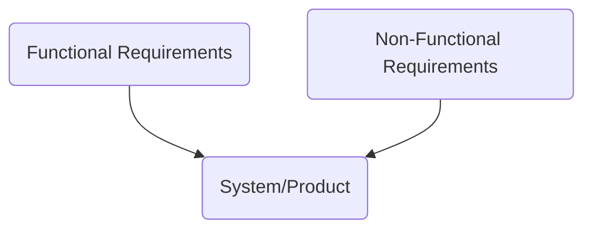

# Requirements Analysis and Specification

## Specification of Project Requirements

## Business Rules

Business rules describe the operations, definitions, and constraints that apply to an organization intended to assert business structure or to control or influence the behavior of the business. Outline the policies, procedures, or regulations governing the industry. It is defined by stakeholders, subject matter experts, or regulatory bodies.

**Business Rules Examples**:

- A customer must be at least 18 years old to purchase alcohol.
- All employees must submit their timesheets by Friday at 5:00 PM.
- Customers should be notified and offered a rain check if an item is out of stock.
- Customers must have a valid driver's license to rent a vehicle.
- A quote must be completed before an invoice is generated.

**Business Rules vs. Business Requirements**

**Business Rules** are lists of statements that tell you whether you may or may not do something or give you the criteria and conditions for making a decision. **Guidelines for behavior and decision-making within business.**

**Business Requirements** are what you need to do to enable the implementation of and compliance with Business Rules. **Describe the high-level goals and outcomes that a project or initiative should achieve.**

**EACH BUSINESS RULE MAY NEED MULTIPLE REQUIREMENTS**

Example:

Business Rule: **A quote must be completed before an invoice is generated.**

Business Requirements: 

- Capability to enter a quote.
- Details from the quote must automatically flow to the invoice.
- Ability to tie the quotes and invoices together for reporting.

## Deriving Requirements

### Parsing Requirements 

Breaking down requirements that are too broad. Removing 'and' from requirements.

**Example** 

**Original Requirement**:

User-completed fields on tax forms shall be converted to electronic text documents.

**Parsed Requirements**:

- The system shall be able to convert handwriting to text.
- The system shall be able to convert machine print to text.
- The system shall be able to correct user-completed fields electronically.

### Interpreting Requirements

Reduce the generalness and ambiguity of stated requirements.

**Example** 

**Original Requirement:**

Each PC shall have state-of-the-art software installed.

**Interpreted Requirement:**

Each PC shall have Microsoft Office 2019 and Windows 10 installed.

### Focusing Requirements

Combine overlapping requirements into one focused requirement?

**Example** 

**Original Requirements:**

- Each PC must have a standard spreadsheet tool installed in Windows.
- Each PC must have a standard tool for creating text documents installed that runs in Windows.

**Focused Requirement:**

Each PC on the LAN shall have Microsoft Office Package 2019.

### Qualifying Requirements

Add a requirement to provide a method of verification or compliance.

**Example** 

**Original Requirement:**

The xxx command must perform the following actions.

**Qualified Requirement:**

Each command shall be executed during system testing to demonstrate its functionality.
